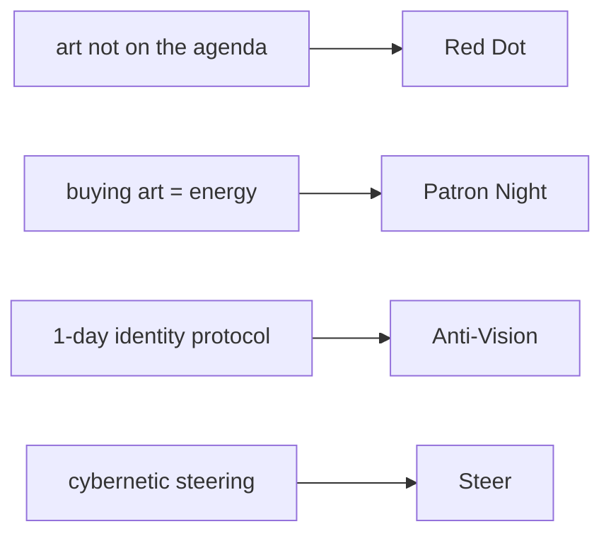

# Product ideas — Red Dots × Fix your life in 1 day

Four AI-native concepts derived from the two imports and run through the ideation lens (AI-native, contextual trust, live shared experiences, collaboration over performance, anti-exploitation). All flagged _derived_ — the sources describe the problem and the psychology; they do not propose these products. Each passes the sanity check: still good for the user if it earned the company nothing from engagement.

## Items

- **Red Dot** — a contextual-trust patronage app: you see which works the *people you actually trust* have bought (scoped to a person and a relationship, never a public clout score), turning collecting into a quiet signal among friends rather than a status game. Puts art 'on the agenda' through trusted context, not vanity. — [[Red Dots (essay)#the agenda|rd:agenda]], [[Red Dots (essay)#the red dot|rd:purchase-energy]], [[Operator context reference#The ideation lens|op:lens]] _derived_
- **Patron Night** — AI-orchestrated live, co-present micro-patronage: a small circle gathers at a studio or show (in person or synchronous video) and the app facilitates collective commissioning or split acquisition *in the moment*. Converts buying art from a solitary transaction into a shared live event that injects energy into culture. — [[Red Dots (essay)#the red dot|rd:purchase-energy]], [[Red Dots (essay)#art's role|rd:gift]], [[Center for Humane Technology|cht:persuasive]] _derived_
- **Anti-Vision** — a file-over-app reflection tool that runs Koe's one-day protocol as a private, you-own-the-files practice: AI asks the vision/anti-vision questions and schedules the pattern-break interrupts, but every answer is plain Markdown you keep — no streaks, no engagement loops. A genuinely transformative protocol that refuses to become a trap. — [[How to fix your entire life in 1 day#VI|koe:phases]], [[How to fix your entire life in 1 day#VII|koe:videogame]], [[File over app|foa:def]] _derived_
- **Steer** — an AI cybernetic companion for artists: define your vision and constraints, and it senses where you are versus the goal and proposes the next small lever — the thermostat model applied to a creative practice, scoped to *your* definition of winning, not platform metrics. Sustains the years-long energy the essay names as the real bottleneck. — [[How to fix your entire life in 1 day#V|koe:cybernetics]], [[How to fix your entire life in 1 day#I|koe:lifestyle]], [[Red Dots (essay)#on making art|rd:turtles]] _derived_

## Concept map

> [!info]- Intent timeline
> Each stage's understanding of the request. ⚠ marks a stage Reflection blamed for an intent/strategy miss.
> - **elicitation** (attempt 0, conf 0.86, claude (this chat)): Generate product ideas from the two imports; scope = the imports; apply the operator's ideation lens.
> - **planning** (attempt 0, conf 0.85, claude (this chat)): task = ideas; one concept per anchored hook (patronage agenda, art-as-energy, the protocol, cybernetic steering); shape = Name — what it is; why it helps; flag all derived.
> - **retrieval** (attempt 0, conf 0.88, claude (this chat)): Pull the agenda/energy/identity bites plus the lens bites (contextual trust, anti-exploitation, file-over-app).
> - **synthesis** (attempt 0, conf 0.87, claude (this chat)): Four cited, derived-flagged ideas; each AI-native, trust-scoped, live or anti-exploitation; sanity-checked against engagement.
> - **reflection** (attempt 0, conf 0.91, claude (this chat)): Grounding, citations, lens-fit and the no-engagement sanity check all hold → ship.

> [!note]- Agent trace
> Full machine-readable trace saved beside this note as `trace.json`.
