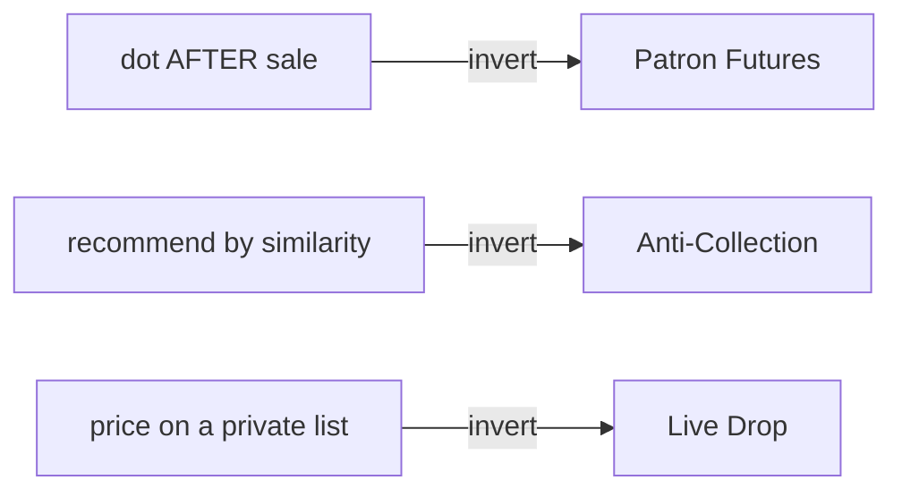

# Product ideas v2 — forged, not listed

Same corpus, novelty engine on: diverge → kill the vanilla → forge survivors with
conceptual blend / norm-inversion / provocation → keep ≤3. Each is anchored to
source bites and flagged _derived_. Reflection's NOVELTY gate failed anything an
average tool would say.

> [!fail]- Killed in the vanilla pass
> Trust-patronage app · live micro-patronage event · journaling tool for Koe's
> protocol · "AI art advisor" · art-rental subscription. All buildable in 2010
> with a coat of AI. Cut.

## The three

**1 · Patron Futures** — *the red dot moves to* ***before*** *the work.*
The norm: a dot marks a finished piece, sold. Invert it — a trust-scoped circle
backs an artist's next 12 months and redeems in pieces-to-come; AI prices the
*momentum of the practice*, not the object. Hard to copy: galleries sell objects,
not trajectories, and can't underwrite "energy." Directly attacks the sea-turtle
attrition — funds the long middle where artists vanish. Artist sets terms, owns
the data, no public leaderboard. _derived_ — [[Red Dots (essay)#the red dot|rd:purchase-energy]], [[Red Dots (essay)#on making art|rd:turtles]], [[How to fix your entire life in 1 day#V|koe:cybernetics]]

**2 · Anti-Collection** — *recommendation by repulsion.*
The norm: recommenders push what's *similar* to what you love. Invert it — AI
builds your **anti-collection** (the art you'd be embarrassed to own, the taste
you're fleeing) from Koe's anti-vision, then surfaces only the rare piece that
violates it in exactly the right way. Hard to copy: it models an aesthetic
*anti-vision*, the opposite of every recommender's incentive. Taste defined by
what you reject — an artist's idea, not a store's. _derived_ — [[How to fix your entire life in 1 day#VI|koe:phases]], [[Center for Humane Technology|cht:persuasive]], [[Red Dots (essay)#art's role|rd:gift]]

**3 · Live Drop** — *price discovered like a future-funk drop.*
The norm: a gallerist prices privately on a list. Invert it — the show opens with
**nothing priced**; an AI reads a trusted live audience (in-room + remote) and red
dots *appear in real time* as collective energy peaks, like a DJ dropping the
track when the floor is ready. Hard to copy: a new ritual fusing performance and
market — needs a real-time crowd read over a trust-scoped room; incumbents
structurally can't. No vanity counts; the artist and the room win, not a
middleman. _derived_ — [[Red Dots (essay)#the agenda|rd:agenda]], [[Operator context reference#Interests|op:taste]], [[Young Franco — Vice|yf:futurefunk]]

## Concept map

