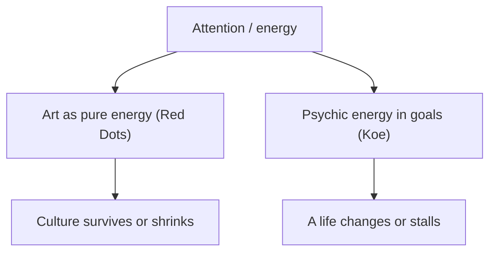

# Insights — Red Dots × Fix your life in 1 day

Reading the two imports together. Each insight is grounded in source bites; cross-document connections that go beyond either text are flagged _derived_. Scope = the two imports.

## Items

- **Attention is the single currency in both texts.** Koe's 'psychic energy invested in goals' and the essay's claim that buying art is 'pure energy' for culture are the *same resource* — culture and a life both starve when attention is never deliberately directed. — [[How to fix your entire life in 1 day#VII|koe:flow]], [[Red Dots (essay)#the red dot|rd:purchase-energy]], [[Red Dots (essay)#energy & economy|rd:energy]] _derived_
- **Israel's neglect of art is an agenda problem, not a taste problem.** Koe shows behavior reveals true goals; a society that spends freely on restaurants and travel but never *considers* art is revealing what it actually values — the fix is making art visible, not cheaper. — [[Red Dots (essay)#the agenda|rd:agenda]], [[How to fix your entire life in 1 day#II|koe:teleological]], [[Red Dots (essay)#Israel 2026|rd:secondary]] _derived_
- **The 'sea turtle' attrition is Koe's Uncertainty phase.** Most artists vanish not for lack of talent but for lack of sustaining energy through the long middle — the same Dissonance→Uncertainty→Discovery valley where most identity changes die. — [[Red Dots (essay)#on making art|rd:turtles]], [[Red Dots (essay)#the shrinking|rd:disappear]], [[How to fix your entire life in 1 day#VI|koe:phases]] _derived_
- **A goal is a lens — so is a red dot.** Collecting isn't on people's agenda because no goal has made art perceptible to them; change the lens (give them a reason to look) and the buying behavior follows, exactly as Koe describes perception bending to goals. — [[How to fix your entire life in 1 day#II|koe:goal-lens]], [[Red Dots (essay)#the agenda|rd:agenda]] _derived_
- **Under-investing in art is under-investing in a society's complexity.** The essay's strongest in-source claim: art is cultural DNA, so a culture that lets it shrink is choosing to become simpler and less meaningful. — [[Red Dots (essay)#art's role|rd:gift]], [[Red Dots (essay)#the plea|rd:culture-is-us]]

## Concept map

> [!info]- Intent timeline
> Each stage's understanding of the request. ⚠ marks a stage Reflection blamed for an intent/strategy miss.
> - **elicitation** (attempt 0, conf 0.84, claude (this chat)): Surface insights that read the two imports together; scope = the two documents.
> - **planning** (attempt 0, conf 0.83, claude (this chat)): task = insights; strategy = find the shared structure (energy/attention, goals-as-lens, the attrition valley); flag cross-document synthesis as derived.
> - **retrieval** (attempt 0, conf 0.88, claude (this chat)): Pull the energy/agenda/identity bites from both namespaces; admit no outside knowledge.
> - **synthesis** (attempt 0, conf 0.86, claude (this chat)): Five grounded insights; each cites its bites; cross-document links flagged derived.
> - **reflection** (attempt 0, conf 0.90, claude (this chat)): Grounding and citations hold; derived links honest → ship.

> [!note]- Agent trace
> Full machine-readable trace saved beside this note as `trace.json`.
