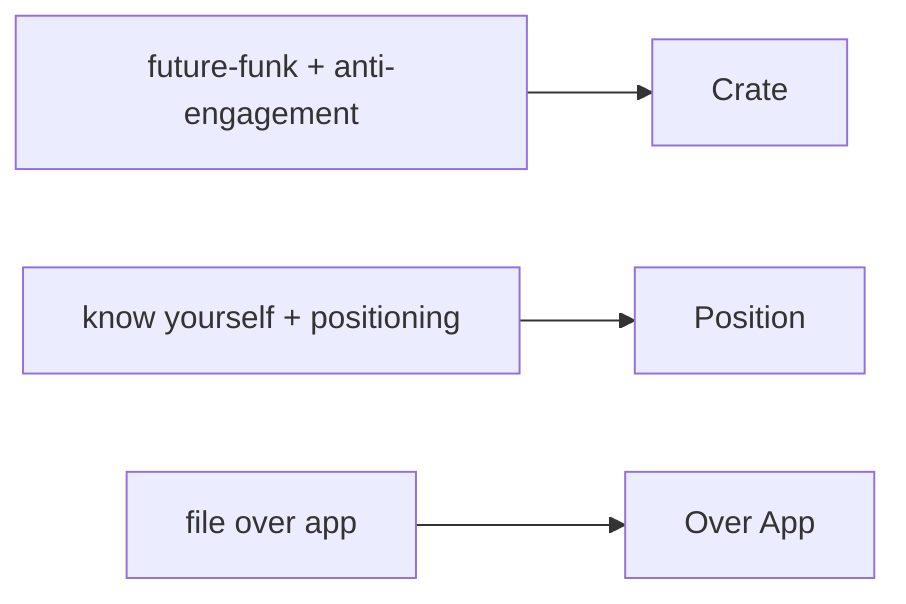

# Profile-grounded product ideas

Three AI-native concepts derived from the operator's own corpus (music taste, strategy frame, humane-tech values, file-over-app). Each is flagged _derived_ — the sources describe the principles; they do not propose these products. Scope = just the import.

## Items

- **Crate** — a live, invite-only listening room where an AI weaves your inner circle's track picks into one continuous future-funk set in sync: music as a shared present-tense moment, with no follower counts or vanity metrics. — [[Young Franco — Vice|yf:futurefunk]], [[cht:persuasive]], [[op:lens]] _derived_
- **Position** — an AI strategy room that ingests your research notes and keeps a living map of where you're strong and where a market is underserved, turning 'know yourself / strike where unexpected' into an inspectable, evidence-linked board. — [[The Art of War, applied to business|aow:know]], [[Sun Tzu for Small Business Leaders|aow:position]], [[op:trace]] _derived_
- **Over App** — every artifact the tool makes is a plain-Markdown file you own, with an AI longevity check that flags anything locked to a proprietary format and rewrites it to open formats. — [[File over app|foa:def]], [[File over app|foa:portable]], [[Operator context reference#Who you are building for|op:throughline]] _derived_

## Concept map

> [!info]- Intent timeline
> Each stage's understanding of the request. ⚠ marks a stage Reflection blamed for an intent/strategy miss.
> - **elicitation** (attempt 0, conf 0.88, claude (this chat)): Produce product ideas grounded in the operator's interests/values corpus; scope = just the import.
> - **planning** (attempt 0, conf 0.86, claude (this chat)): task = ideas; derive one concept per anchored theme (music/anti-engagement, strategy, file-over-app); shape = Name — what it is; why it helps; flag everything derived.
> - **retrieval** (attempt 0, conf 0.90, claude (this chat)): Pull the bites relevant to each theme from the profile store; admit no model/web knowledge (scope = import).
> - **synthesis** (attempt 0, conf 0.87, claude (this chat)): 3 cited, derived-flagged ideas in the planned shape; apply the ideation lens (AI-native, contextual trust, live, collaborative, anti-exploitation).
> - **reflection** (attempt 0, conf 0.91, claude (this chat)): Grade grounding, citations and lens-fit; all hold → ship.

> [!note]- Agent trace
> Full machine-readable trace saved beside this note as `trace.json`.
