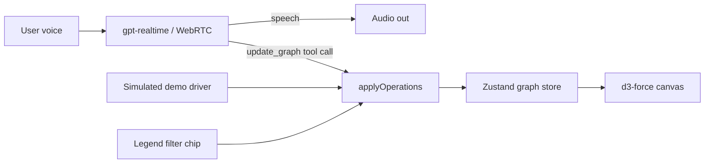

# Conversation Graph — prototype

A voice-first assistant where the conversation's context is rendered as a living knowledge graph. Talk to ChatGPT's native voice (OpenAI Realtime API) and watch every place, friend, and source it mentions appear as nodes and edges — then say *"show me only the ones my friends recommended"* and watch the graph filter live.

## Run it

```bash
npm install
npm run dev        # http://localhost:5173
```

Two modes (toggle in the header):

- **Simulated** (default, no API key): press ▶ or Space to play the canonical 5-step demo — restaurant bloom → friends-only filter → cheapest highlight → restore → hotel pivot. Assistant lines are spoken with the browser's speech synthesis; graph payloads go through the exact same code path as live tool calls.
- **Live voice**: copy `.env.example` to `.env`, set `OPENAI_API_KEY`, restart `npm run dev`, switch to "Live voice" and tap the mic. The token server (`server/index.mjs`) mints an ephemeral Realtime client secret — the API key never reaches the browser. The session runs `gpt-realtime` over WebRTC with server VAD (barge-in works) and a single `update_graph` tool the model must call every turn it changes the screen.

## How it works



The one invariant: **every visual change flows through `applyOperations`** in `src/store/graphStore.js` — live tool calls, the simulated script, and the legend's filter chip all use it. Operations: `add_nodes`, `add_edges`, `apply_filter`, `clear_filter`, `remove_nodes`, `highlight`, `focus`, plus a `title`.

Filters are declarative and **stack**; nodes that fail them are ghosted (12% opacity), never deleted, so "show everything again" restores instantly with positions intact. Sources whose every place is ghosted dim; friends with surviving picks glow. Click any node for a popover with details and the recommenders' actual quotes.

## Layout of interest

| Path | What |
|---|---|
| `src/store/graphStore.js` | Graph state + `applyOperations` + filter semantics |
| `src/graph/GraphCanvas.jsx` | d3-force layout, pan/zoom camera, drag, entrance animations, popover |
| `src/voice/sessionConfig.js` | The `update_graph` tool schema + voice instructions + embedded dataset (shared with the token server) |
| `src/voice/realtime.js` | WebRTC client for the Realtime API |
| `src/voice/simulated.js` + `src/data/demoScript.js` | Scripted demo mode |
| `src/data/mockData.js` | Curated NYC dataset (8 restaurants, 4 hotels, 3 friends, 4 publications, quotes) |
| `server/index.mjs` | `POST /session` → ephemeral Realtime client secret |

## Notes on choices

- Plain JSX + hand-rolled CSS instead of TypeScript/Tailwind — fastest path to a dependable prototype; the graph engine is the point.
- The canvas is hand-built (SVG edges + positioned divs + d3-force) rather than React Flow: full control over ghosting, glow states, entrance stagger, and the camera.
- The assistant is instructed to answer only from the embedded dataset, so live-voice demos are deterministic.
